<!--<p align="center">-->
<!--   
<!--        alt="FoodEase Logo"  -->
<!--        width="300px" -->
<!--        style="height: auto; display: block; margin: 0 auto;"> -->
<!-- </p> -->
<!-- <p align="center"> -->
<!--    -->
<!-- </p> -->

[](https://x.com/shreyamahalle)
[](https://opensource.org/licenses/Apache-2.0)


[](https://www.jetbrains.com/idea/)


<table align="center">
  <tr>
    <td>
      
    </td>
    <td>
      
    </td>
  </tr>
</table>

## Foodease - Food Order Booking System

## Table of Contents

- [Introduction](#introduction)
- [Advanced_Features](#Advanced-Features)
- [Features](#features)
- [Technology Stack](#Technology-Stack)
- [Getting Started](#Getting-Started)
- [Installation and Setup](#Installation-and-Setup)
- [API Endpoints (CRUD)](#api-endpoints-crud)
- [Postman Collection](#Postman-Collection)
- [Module Responsibilities](#Module-Responsibilities)
- [Spring Annotations](#Spring-Annotations)
- [Code Structure ](#Code-Structure )
- [Database Schema (POJO Classes)](#Database-Schema-(POJO-Classes))
- [Class Diagram](#Class-Diagram)
- [Contact](#contact)
- [Best Practices Followed](#Best-Practices-Followed)
- [Future Scope](#Future-Scope)
- [License](#license)
- [Author](#Author)

# **foodease-food-order-booking-system**

**Foodease** is a Java Spring-based online food ordering and booking system. It allows customers to register, browse restaurants, place orders, and receive deliveries from nearby agents. The system is modular, scalable, and designed for real-world business needs.

> **Use case**: A food ordering platform where customers can register, explore nearby restaurants, place orders, and get deliveries from available agents based on location and serviceability.

## Advanced Features

### Filters & Interceptors
1. **Request Logging Filter**: Logs all incoming requests
2. **Authentication Filter**: JWT validation for secure endpoints
3. **Response Time Interceptor**: Measures API response times
4. **Request Validation Interceptor**: Validates payloads before controller processing

### Scheduled Tasks

1. **Daily Sales Report**: Generated at midnight
2. **Order Status Updates**: Hourly checks for pending orders
3. **Promotion Engine**: Weekly coupon generation

### Email Service

- Order confirmation emails
- Delivery status updates
- Password reset functionality
- Promotional campaigns

## Introduction

## Project Overview

The Spring Booking Management System provides a modular approach to managing:

- Customers
- Restaurants
- Delivery Agents
- Orders
- CartItem
- Coupon
- MenuItem
- Feedback
- Review
- BookingTable
- Payment
- Orderstatus
- Request Filtering
- **API Interception**
- **Scheduled Jobs**
- **Email Notifications**

It mimics real-world operations like customer registration, restaurant assignment, order placing, and delivery
tracking — all managed using a clean layered architecture (Controller → Service → Repository).

---

## Features

## Key Features

-  Customer and Restaurant Booking Management: Effortlessly handle customer bookings and restaurant data.
-  Delivery Agent Simulation: Assign delivery agents based on location and availability.
-  Dynamic Order Handling: Add, track, and manage orders through their entire lifecycle.
-  Seamless Java Integration: Clean integration of Java models for each entity (Customer, Delivery Agent, Order,
   Restaurant).
-  Easy-to-Follow Structure: Well-documented, clean code for learning and demonstration.
-  Layered Architecture: Clean separation of concerns.
-  REST API: Full CRUD functionality exposed via REST.

---

## Technology Stack

This project is built with the following technologies:


| Technology        | Purpose                                   |
|------------------|-------------------------------------------|
| Java 21           | Core language                            |
| Spring Boot       | Application framework                    |
| Spring Web        | RESTful APIs                             |
| Spring Data JPA   | Database operations                      |
| Hibernate         | ORM mapping                              |
| JSP/Servlets      | Web interface                            |
| MySQL             | Relational database                      |
| Maven             | Project management and build             |
| Lombok            | Boilerplate reduction                    |
| HTML5/CSS3        | Frontend structure                       |
| Git               | Version control                          |
| Postman           | API Testing                              |
---

## Getting Started

## Installation and Setup

### Prerequisites

Before you begin, ensure you have the following:

- **Java Development Kit (JDK) 21**: Install the latest JDK for optimal performance.
- **Maven**: Make sure Maven is installed to handle the project build.
- **MySQL Database**: You'll need to have MySQL installed and set up to manage your data.
- **Apache Tomcat**: A servlet container for running your web application.
- **IDE**: Use IntelliJ IDEA, Eclipse, or any Java IDE you're comfortable with.
- **Git (optional)**: For version control and easier collaboration.

## Steps to Get Started

## 1. **Clone the Repository:**

   ```bash
   git clone (https://github.com/shreyamahalle/foodease-food-order-booking-system.git)
```

## 2. **Navigate to the Project Directory:**

```bash
 cd spring-boot-booking-management-project
```

## 3. **Open the Project in Your Preferred IDE:**

```bash
 Launch your IDE (IntelliJ, Eclipse, etc.), and open the cloned repository.
```

## 4. **Set up the MySQL Database:**

```bash
  CREATE DATABASE booking_management;
  USE booking_management;
```

## 5. **MySQL Database Setup**
- To set up the database and create the necessary tables, run the following SQL queries:
```bash
 -Insert sample data into the Customer table
  INSERT INTO Customer (name, username, mobileNo, city, area)
  
 -VALUES ('John Doe', 'johndoe123', '123-456-7890', 'New York', 'Manhattan');

```

## 6. **Configure Your MySQL Connection:**

- In your project configuration (application.properties), set the MySQL database connection details.

- Example application.properties:

- spring.datasource.url=jdbc:mysql://localhost:3306/booking_management
- spring.datasource.username=root
- spring.datasource.password=your_password
- spring.datasource.driver-class-name=com.mysql.cj.jdbc.Driver

## 7. **Compile and Run the Application:**

- Locate Main.java in your IDE.
  
- Run the file to launch the application.

## 8. **Build the project:**

   ```bash
   mvn clean install
   ```
## API Endpoints (CRUD)

### 🧍 Customer APIs

| Method | Endpoint             | Description               |
|--------|----------------------|---------------------------|
| GET    | `/api/customer`     | Get all customers         |
| GET    | `/api/customer/{id}`| Get customer by ID        |
| POST   | `/api/customer`     | Add a new customer        |
| PUT    | `/api/customer/{id}`| Update existing customer  |
| DELETE | `/api/customer/{id}`| Delete customer by ID     |

---
### Retrieve Specific inserted values

    curl --location 'http://localhost:8080/api/customerManagement/customer/6'
    
### Retrieve all the inserted values

    curl --location 'http://localhost:8080/api/customerManagement/customer


### Delete Specific inserted values

    curl --location 'http://localhost:8080/api/customerManagement/customer
    
### 🍽️ Restaurant APIs

| Method | Endpoint               | Description                 |
|--------|------------------------|-----------------------------|
| GET    | `/api/restaurant`     | Get all restaurants         |
| POST   | `/api/restaurant`     | Add a restaurant            |
| PUT    | `/api/restaurant/{id}`| Update restaurant           |
| DELETE | `/api/restaurant/{id}`| Delete restaurant           |

---

### 📦 Order APIs

| Method | Endpoint         | Description               |
|--------|------------------|---------------------------|
| GET    | `/api/order`    | Get all orders            |
| POST   | `/api/order`    | Place new order           |
| PUT    | `/api/order`    | Update order details      |
| DELETE | `/api/order `   | Delete order by ID        |

---

### 🛵 Delivery Agent APIs

| Method | Endpoint                | Description                |
|--------|-------------------------|----------------------------|
| GET    | `/api/deliveryAgentagent`           | Get all delivery agents    |
| POST   | `/api/agent`           | Add a delivery agent       |
| PUT    | `/api/deliveryAgent/{id}`      | Update agent details       |
| DELETE | `/api/deliveryAgent/{id}`      | Delete agent by ID         |

---
## Postman Collection

You can test the REST APIs using Postman:

### 🌐 Sample JSON for POST requests:

**POST /api/customers**

```json
{
  "name": "John Doe",
  "username": "john123",
  "mobileNo": "1234567890",
  "city": "Mumbai",
  "area": "Andheri"
}
``` 
## POST /api/restaurants
```json
{
  "name": "Pizza Palace",
  "city": "Mumbai",
  "area": "Bandra"
}
```
POST /api/orders
```json
{
  "customerId": 1,
  "restaurantId": 2,
  "deliveryAgentId": 3
}
```
## Module Responsibilities

- **Customer**: Handles user registration, city/area resolution, and personalization.
- **Restaurant**: CRUD operations and geo-based filtering logic.
- **Order**: Links Customers to Restaurants; encapsulates logistics and contact info.
- **Delivery Agent**: Assignments and delivery lifecycle management.

## Spring Annotations

- Overview of Spring Annotations
  In this project, Spring annotations replace XML-based configuration for defining beans, enabling easier configuration
  and management of the application. The following annotations are used:

1. @Configuration
   Description: Marks the class as a source of bean definitions for the application context. This is used in place of
   XML configuration files.

2. @ComponentScan
   Description: Tells Spring to scan the specified base package(s) for annotated components (like @Service, @Controller,
   @Repository, etc.) and register them as beans in the Spring context.

3. @Service
   Description: Indicates that a class is a service, which typically holds business logic. It's a specialization of
   @Component.

4. @Repository
   Description: Marks a class as a Data Access Object (DAO), typically used for database-related operations. It also
   provides exception translation.

5. @Controller
   Description: Marks a class as a Spring MVC controller, handling incoming HTTP requests.
6. @Autowired
   Description: Automatically injects the dependencies into the Spring beans. It can be used on fields, constructors, or
   setter methods.
7. @Bean
   Description: Used to define a bean within a @Configuration annotated class. It's a method-level annotation.


## Contact

For any questions or suggestions, feel free to open an issue or contact me directly:

- **GitHub:** [Shreya Mahalle](https://github.com/shreyamahalle)

---

*This README was generated by [Shreya Mahalle](https://github.com/shreyamahalle).*

## License

This project is licensed under the MIT License - see the [LICENSE.md](LICENSE.md) file for details.

## Code Structure

```
src/
└── main/
    ├── java/
    │   └── com.booking
    │       ├── config/             # App configuration
    │       ├── controller/         # REST controllers
    │       ├── model/              # Entity classes
    │       ├── repository/         # Data access interfaces
    │       ├── service/            # Business logic
    │       └── BookingApplication  # Main class
    └── resources/
        ├── application.properties
        └── static/templates

```

## **Functionality**

1. **Customer**
2. **DeliveryAgent**
3. **Order**
4. **Restaurant**
5. **Feedback**
6. **Review**
7. **BookingTable**
8. **Payment**
9. **Orderstatus**
10. **Review**
11. **MenuItem**
12. **Notification**
13. **Coupon**

## **🔧 Core Functionality**

1. Customer Management
   Allows you to create and manage customer information such as name, username, contact details, and address.

2. Delivery Agent Management
   Adds delivery agents, assigns them to orders, and tracks their delivery status.

3. Order Management
   Manages the creation, display, and tracking of customer orders from placement to delivery.

4. Restaurant Management
   Registers new restaurants, displays restaurant details, and associates them with orders.

5. Feedback
   Allows customers to leave feedback on restaurants and delivery services.

6. Review
   Allows customers to leave ratings and reviews for restaurants and orders.

7. BookingTable
   Manages bookings for customers at restaurants, including tracking the booking status and details.

8. Payment
   Handles payment processing for orders and bookings, ensuring successful transactions.

9. Orderstatus
   Tracks and updates the status of customer orders, such as pending, delivered, or cancelled.
## Database Schema (POJO Classes)

| **Entity**        | **Attributes**                              |
|-------------------|---------------------------------------------|
| **Customer**      | user id, name, username,monbileNo,city,area |
| **DeliveryAgent** | id, name, city, mobileNo                    |
| **Order**         | id, name, city, mobileNo                    |
| **Restaurant**    | registerNo, name, City, Area                |

---


# Class Diagram

```mermaid
---
title: foodease-food-order-booking-system (Extended)
---
classDiagram

 note " food order booking management "

class Customer {
  +int customerId
  +String firstName
  +String lastName
  +String email
  +String phone
  +String address
  +createCustomer()
  +updateCustomer()
  +displayCustomer()
}

class Restaurant {
  +int restaurantId
  +String name
  +String cuisineType
  +String address
  +String contact
  +String openingHours
  +createRestaurant()
  +updateRestaurant()
  +displayRestaurant()
}

class Order {
  +int orderId
  +Date orderDate
  +String deliveryAddress
  +String status
  +createOrder()
  +updateOrder()
  +displayOrder()
}

class Payment {
  +int paymentId
  +String paymentMethod
  +double amount
  +String status
  +Date paymentDate
  +createPayment()
  +updatePayment()
  +displayPayment()
}

class DeliveryAgent {
  +int agentId
  +String name
  +String vehicleNumber
  +String contact
  +String status
  +createDeliveryAgent()
  +updateDeliveryAgent()
  +displayDeliveryAgent()
}

class Feedback {
  +int feedbackId
  +int rating
  +String comments
  +Date feedbackDate
  +createFeedback()
  +displayFeedback()
}

class Review {
  +int reviewId
  +int rating
  +String comments
  +Date reviewDate
  +createReview()
  +displayReview()
}

class OrderStatus {
  +int statusId
  +String status
  +Date statusDate
  +createOrderStatus()
  +displayOrderStatus()
}

class BookingTable {
  +int bookingId
  +Date bookingDate
  +int numberOfPeople
  +String specialRequests
  +createBooking()
  +updateBooking()
  +displayBooking()
}

%% New Classes
class MenuItem {
  +int menuItemId
  +String name
  +String description
  +double price
  +boolean isAvailable
  +createMenuItem()
  +updateMenuItem()
  +displayMenuItem()
}

class Notification {
  +int notificationId
  +String message
  +Date sentDate
  +boolean isRead
  +sendNotification()
  +markAsRead()
  +displayNotification()
}

class Coupon {
  +int couponId
  +String code
  +double discount
  +Date expiryDate
  +boolean isActive
  +applyCoupon()
  +validateCoupon()
  +displayCoupon()
}

Customer "1" --> "*" Order : places
Customer "1" --> "*" Feedback : provides
Customer "1" --> "*" Review : writes
Customer "1" --> "*" BookingTable : makes

Restaurant "1" --> "*" Order : receives
Restaurant "1" --> "*" Review : has
Restaurant "1" --> "*" BookingTable : accepts

Order "1" --> "1" Payment : has
Order "1" --> "1" DeliveryAgent : assigned to
Order "1" --> "*" OrderStatus : has

Payment --> Customer : paid by
DeliveryAgent --> Order : delivers

%% New Relationships
Restaurant "1" --> "*" MenuItem : offers
Order "*" --> "*" MenuItem : contains
Customer "1" --> "*" Notification : receives
Coupon "*" --> "*" Order : applied to

class CustomerController {
  +createCustomer()
  +getCustomer()
  +updateCustomer()
  +deleteCustomer()
}

class RestaurantController {
  +createRestaurant()
  +getRestaurant()
  +updateRestaurant()
  +deleteRestaurant()
}

class OrderController {
  +createOrder()
  +getOrder()
  +updateOrder()
  +cancelOrder()
}

CustomerController --> CustomerService
RestaurantController --> RestaurantService
OrderController --> OrderService

class CustomerService {
  +registerCustomer()
  +authenticateCustomer()
  +updateCustomerProfile()
}

class RestaurantService {
  +registerRestaurant()
  +updateRestaurantInfo()
  +manageMenu()
}

class OrderService {
  +placeOrder()
  +trackOrder()
  +cancelOrder()
}

CustomerService --> CustomerRepository
RestaurantService --> RestaurantRepository
OrderService --> OrderRepository

class CustomerRepository {
  +save()
  +findById()
  +findAll()
  +delete()
}

class RestaurantRepository {
  +save()
  +findById()
  +findAll()
  +delete()
}

class OrderRepository {
  +save()
  +findById()
  +findAll()
  +delete()
}
```




## Best Practices Followed
- MVC Layering: Each layer has a single responsibility and adheres to open/closed principle.
- Exception Handling: Extendable @ControllerAdvice class can be added for custom error management.
- Validation: javax.validation annotations (future improvement) to enforce domain constraints.
- DTO Mapping: DTOs can be introduced for request/response abstraction (optional enhancement).
- Lombok: Reduces boilerplate while maintaining readability.

## Future Scope
- Add unit tests using JUnit + Mockito
- API authentication using Spring Security or JWT
- Integration with Kafka or RabbitMQ for event-driven order tracking
- CI/CD with GitHub Actions
- Dockerization and deployment to Kubernetes or AWS ECS

---

## Author

Shreya Mahalle  
[GitHub](https://github.com/shreyamahalle) | [LinkedIn](https://linkedin.com/in/shreyamahalle)

---

